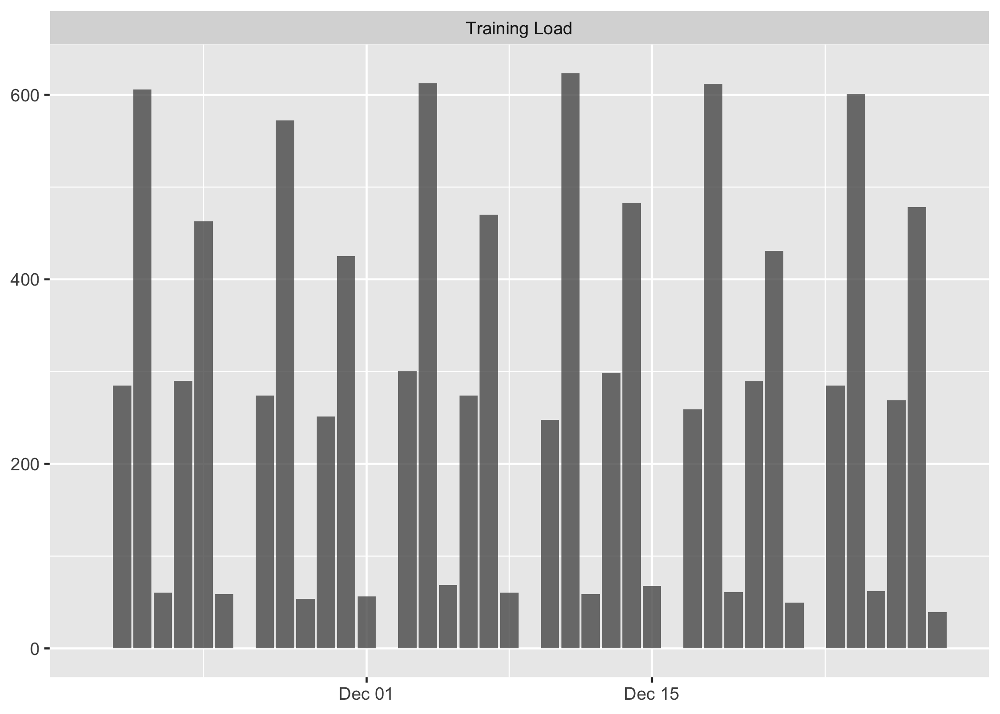
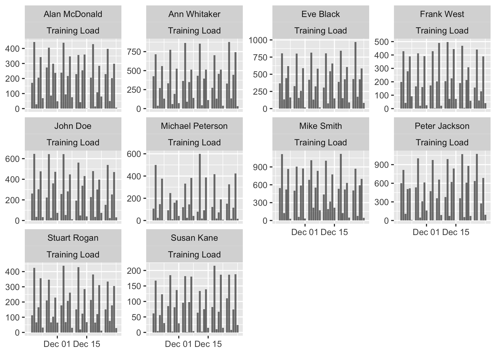
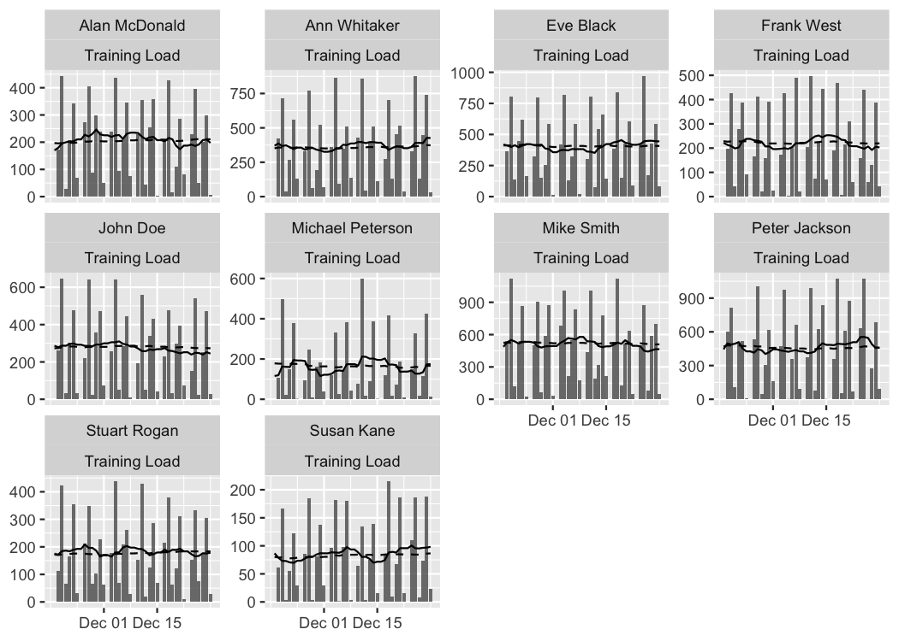
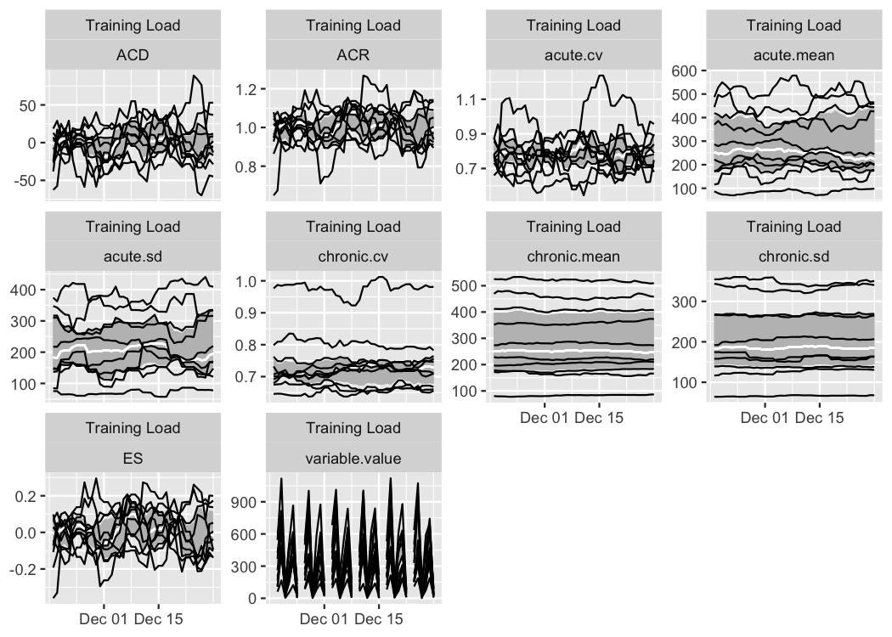
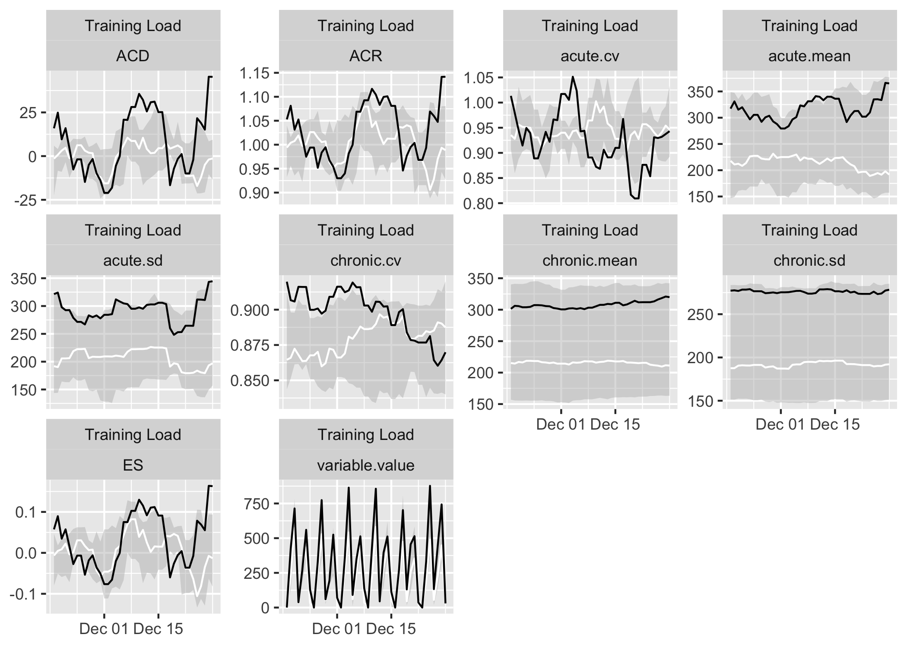

<!-- README.md is generated from README.Rmd. Please edit that file -->

# athletemonitoring

<!-- badges: start -->

[](https://zenodo.org/badge/latestdoi/298780725)
[](https://CRAN.R-project.org/package=athletemonitoring)
<!-- badges: end -->

Athlete monitoring data often comes in a form of time series or panel
data. The goal of `athletemonitoring` package is to help in preparing
these types of datasets using contemporary best practices which involve
dealing with missing values, aggregating data on a day-level, creating
rolling averages and finally providing visualizations.

## Installation

You can install the released version of `athletemonitoring` from
[CRAN](https://CRAN.R-project.org) when it is available with:

``` r
install.packages("athletemonitoring")
```

And the development version from [GitHub](https://github.com/) with:

``` r
# install.packages("devtools")
devtools::install_github("mladenjovanovic/athletemonitoring")
```

## Example

To be added, but while you wait, here is the example from the
documentation:

``` r
require(athletemonitoring)
#> Loading required package: athletemonitoring

# Load monitoring data set
data("monitoring")

# Filter out only 'Training Load'
monitoring <- monitoring[monitoring$Variable == "Training Load", ]

# Convert column to date format (or use numeric)
monitoring$Date <- as.Date(monitoring$Date, "%Y-%m-%d")

# Run the athlete monitoring data preparation
prepared_data <- prepare(
  data = monitoring,
  athlete = "Full Name",
  date = "Date",
  variable = "Variable",
  value = "Value",
  acute = 7,
  chronic = 42,

  # How should be multiple day entries summarised?
  day_aggregate = function(x) {
    sum(x, na.rm = TRUE)
  },

  # Rolling estimators for Acute and Chronic windows
  rolling_estimators = function(x) {
    c(
      "mean" = mean(x, na.rm = TRUE),
      "sd" = sd(x, na.rm = TRUE),
      "cv" = sd(x, na.rm = TRUE) / mean(x, na.rm = TRUE)
    )
  },

  # Additional estimator post-rolling
  posthoc_estimators = function(data) {
    data$ACD <- data$acute.mean - data$chronic.mean
    data$ACR <- data$acute.mean / data$chronic.mean
    data$ES <- data$ACD / data$chronic.sd

    # Make sure to return the data
    return(data)
  },

  # Group summary estimators
  group_summary_estimators = function(x) {
    c(
      "median" = median(x, na.rm = TRUE),
      "lower" = quantile(x, 0.25, na.rm = TRUE)[[1]],
      "upper" = quantile(x, 0.75, na.rm = TRUE)[[1]]
    )
  }
)

# Get summary
prepared_data
#> Athlete monitoring data with the following characteristics:
#> 
#> 10 athletes:
#> Alan McDonald, Ann Whitaker, Eve Black, Frank West, John Doe, Michael Peterson, Mike Smith, Peter Jackson, Stuart Rogan, Susan Kane 
#> 
#> 363 days:
#> From 18263 to 18625 
#> 
#> 1 variables:
#> Training Load 
#> 
#> 10 estimators:
#> variable.value, acute.mean, acute.sd, acute.cv, chronic.mean, chronic.sd, chronic.cv, ACD, ACR, ES
summary(prepared_data)
#> # A tibble: 10 x 13
#>    athlete variable `Day entries` Missing `Start date` `Stop date`  Mean    SD
#>    <chr>   <chr>            <int>   <int> <date>       <date>      <dbl> <dbl>
#>  1 Alan M… Trainin…           312      51 2020-01-02   2020-12-29  202.  133. 
#>  2 Ann Wh… Trainin…           312      51 2020-01-02   2020-12-29  353.  247. 
#>  3 Eve Bl… Trainin…           312      51 2020-01-02   2020-12-29  401.  257. 
#>  4 Frank … Trainin…           312      51 2020-01-02   2020-12-29  218.  155. 
#>  5 John D… Trainin…           312      51 2020-01-02   2020-12-29  272.  207. 
#>  6 Michae… Trainin…           312      51 2020-01-02   2020-12-29  177.  167. 
#>  7 Mike S… Trainin…           312      51 2020-01-02   2020-12-29  514.  344. 
#>  8 Peter … Trainin…           312      51 2020-01-02   2020-12-29  470.  330. 
#>  9 Stuart… Trainin…           312      51 2020-01-02   2020-12-29  177.  122. 
#> 10 Susan … Trainin…           312      51 2020-01-02   2020-12-29   87.6  68.8
#> # … with 5 more variables: Min <dbl>, Max <dbl>, Median <dbl>, IQR <dbl>,
#> #   MAD <dbl>


## Plots

# Table plot
# Produces formattable output with sparklines
# This will not work in the readme file, so just copy paste to your console
#plot(
#  prepared_data,
#  type = "table",
#
#  # Use to filter out estimators
#  estimator_name = c("acute.mean", "chronic.mean", "ES", "chronic.sd", "chronic.cv"),
#
#  # Use to filter out athlete
#  # athlete_name = NULL,
#
#  # Use to filter out variables
#  #variable_name = NULL,
#
#  # Show last entries
#  last_n = 42,
#
#  # Round numbers
#  digits = 2
#)

# Bar plot
# To plot group average
plot(
  prepared_data,
  type = "bar")
#> Plotting average across athletes. Please select athlete or use `trellis=TRUE`
#> Warning: Removed 6 rows containing missing values (geom_bar).
#> Warning: Removed 42 row(s) containing missing values (geom_path).

#> Warning: Removed 42 row(s) containing missing values (geom_path).
```



``` r

# To plot per athlete, use trellis argument
plot(
  prepared_data,
  type = "bar",
  trellis = TRUE)
#> Warning: Removed 60 rows containing missing values (geom_bar).
#> Warning: Removed 420 row(s) containing missing values (geom_path).

#> Warning: Removed 420 row(s) containing missing values (geom_path).
```



``` r

# To filter out athletem variable and add Acute and Chronic lines to the group average:
plot(
  prepared_data,
  type = "bar",

  # To filter out athletes
  # athlete_name = NULL,

  # To filter out variable
  # variable_name = NULL,

  # Add acute mean
  acute_name = "acute.mean",

  # Add chronic mean
  chronic_name = "chronic.mean",

  # Plot last n entries/days
  last_n = 42)
#> Plotting average across athletes. Please select athlete or use `trellis=TRUE`
#> Warning: Removed 6 rows containing missing values (geom_bar).
```


``` r

# If you want to plot for each athlete, use trellis=TRUE
plot(
  prepared_data,
  type = "bar",
  acute_name = "acute.mean",
  chronic_name = "chronic.mean",
  last_n = 42,
  trellis = TRUE)
#> Warning: Removed 60 rows containing missing values (geom_bar).
```



``` r

# Line plots
# These plots represent summary of the rollins estimators
plot(
  prepared_data,
  type = "line",

  # To filter out athletes
  # athlete_name = NULL,

  # To filter out variables
  # variable_name = NULL,

  # To filter out estimators
  # estimator_name = NULL,

  # Tell graph where the lower group estimator is
  # which is in this case 25%th percentile of the group
  group_lower_name = "group.lower",

  # The name of the centrality estimator of the group
  group_central_name = "group.median",

  # Tell graph where the upper group estimator is
  # which is in this case 75%th percentile of the group
  group_upper_name = "group.upper",

  # Use trellis if you do not plot for a single individual
  trellis = TRUE)
```



``` r

# Previous chart looks messy because it plot all athletes
# To avoid that, filter out only one athlete
plot(
  prepared_data,
  type = "line",

 # To filter out athletes
  athlete_name = "Ann Whitaker",

 group_lower_name = "group.lower",
 group_central_name = "group.median",
 group_upper_name = "group.upper",
  trellis = TRUE)
```


