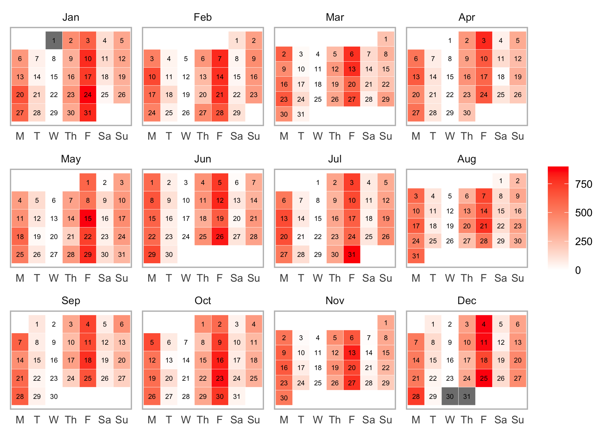

<!-- README.md is generated from README.Rmd. Please edit that file -->

# athletemonitoring 

<!-- badges: start -->

[](https://zenodo.org/badge/latestdoi/298780725)
[](https://CRAN.R-project.org/package=athletemonitoring)
<!-- badges: end -->

Athlete monitoring data often comes in a form of time series or panel
data. The goal of `athletemonitoring` package is to help in preparing
these types of datasets using contemporary best practices which involve
dealing with missing values, aggregating data on a day-level, creating
rolling averages and finally providing visualizations.

## Installation

You can install the released version of `athletemonitoring` from
[CRAN](https://CRAN.R-project.org) when it is available with:

``` r
install.packages("athletemonitoring")
```

And the development version from [GitHub](https://github.com/) with:

``` r
# install.packages("devtools")
devtools::install_github("mladenjovanovic/athletemonitoring")
```

## Example

`athletemonitoring` package is very simple package consisting of only
the `prepare()` function and S3 methods for printing, summarizing, and
plotting. Plotting features in `athletemonitoring` package are very
powerful and flexible and allow you to create table, bar, line, and
calendar heatmap plots.

``` r
require(athletemonitoring)
#> Loading required package: athletemonitoring

# Load monitoring data set
data("monitoring")

# Filter out only 'Training Load'
monitoring <- monitoring[monitoring$Variable == "Training Load", ]

# Convert column to date format (or use numeric)
monitoring$Date <- as.Date(monitoring$Date, "%Y-%m-%d")

# Run the athlete monitoring data preparation
prepared_data <- prepare(
  data = monitoring,
  athlete = "Full Name",
  date = "Date",
  variable = "Variable",
  value = "Value",
  acute = 7,
  chronic = 42, 
  
  # How should be missing entry treated? 
  # What do we assume? Zero load? Let's keep NA
  NA_session =  NA,
  
  # How should missing days (i.e. no entries) be treated?
  # Here we assume no training, hence zero
  NA_day = 0,
  
  # How should be multiple day entries summarised?
  # With "load", it is a "sum", with other metrics that
  # do not aggregate, it can me "mean"
  day_aggregate = function(x) {
    sum(x, na.rm = TRUE)
  },
  
  # Rolling estimators for Acute and Chronic windows
  rolling_estimators = function(x) {
    c(
      "mean" = mean(x, na.rm = TRUE),
      "sd" = sd(x, na.rm = TRUE),
      "cv" = sd(x, na.rm = TRUE) / mean(x, na.rm = TRUE)
    )
  },
  
  # Additional estimator post-rolling
  posthoc_estimators = function(data) {
    data$ACD <- data$acute.mean - data$chronic.mean
    data$ACR <- data$acute.mean / data$chronic.mean
    data$ES <- data$ACD / data$chronic.sd
    
    # Make sure to return the data
    return(data)
  },
  
  # Group summary estimators
  group_summary_estimators = function(x) {
    c(
      "median" = median(x, na.rm = TRUE),
      "lower" = quantile(x, 0.25, na.rm = TRUE)[[1]],
      "upper" = quantile(x, 0.75, na.rm = TRUE)[[1]]
    )
  }
)
#> Preparing data...
#> Rolling...
#> Group summaries...
#> Missing data summaries...
#> Done!

# Get summary
prepared_data
#> Athlete monitoring numeric data with the following characteristics:
#> 
#> 10 athletes:
#> Alan McDonald, Ann Whitaker, Eve Black, Frank West, John Doe, Michael Peterson, Mike Smith, Peter Jackson, Stuart Rogan, Susan Kane 
#> 
#> 363 days:
#> From 18263 to 18625 
#> 
#> 5200 total entries
#> 
#> 0 missing entries
#> 510 missing days
#> 
#> 1 variables:
#> Training Load 
#> 
#> 10 estimators:
#> variable.value, acute.mean, acute.sd, acute.cv, chronic.mean, chronic.sd, chronic.cv, ACD, ACR, ES

summary(prepared_data)
#> # A tibble: 10 x 15
#>    athlete          variable      `Total entries` `Day entries` `Missing entrie…
#>    <chr>            <chr>                   <dbl>         <int>            <dbl>
#>  1 Alan McDonald    Training Load             520           363                0
#>  2 Ann Whitaker     Training Load             520           363                0
#>  3 Eve Black        Training Load             520           363                0
#>  4 Frank West       Training Load             520           363                0
#>  5 John Doe         Training Load             520           363                0
#>  6 Michael Peterson Training Load             520           363                0
#>  7 Mike Smith       Training Load             520           363                0
#>  8 Peter Jackson    Training Load             520           363                0
#>  9 Stuart Rogan     Training Load             520           363                0
#> 10 Susan Kane       Training Load             520           363                0
#> # … with 10 more variables: Missing days <dbl>, Start date <date>,
#> #   Stop date <date>, Mean <dbl>, SD <dbl>, Min <dbl>, Max <dbl>, Median <dbl>,
#> #   IQR <dbl>, MAD <dbl>


## Plots

# Table plot
# Produces formattable output with sparklines
# This will not work in the readme file, so just copy paste to your console
#plot(
#  prepared_data,
#  type = "table",
#
#  # Use to filter out estimators
#  estimator_name = c("acute.mean", "chronic.mean", "ES", "chronic.sd", "chronic.cv"),
#
#  # Use to filter out athlete
#  # athlete_name = NULL,
#
#  # Use to filter out variables
#  #variable_name = NULL,
#
#  # Show last entries
#  last_n = 42,
#
#  # Round numbers
#  digits = 2
#)

# Bar plot
# To plot group average
plot(
  prepared_data,
  type = "bar")
#> Plotting average across athletes. Please select athlete or use `trellis=TRUE`
#> Warning: Removed 42 row(s) containing missing values (geom_path).

#> Warning: Removed 42 row(s) containing missing values (geom_path).
```


``` r
# To plot per athlete, use trellis argument
plot(
  prepared_data,
  type = "bar",
  trellis = TRUE)
#> Warning: Removed 420 row(s) containing missing values (geom_path).
#> Warning: Removed 420 row(s) containing missing values (geom_path).
```


``` r
# To filter out athletem variable and add Acute and Chronic lines to the group average:
plot(
  prepared_data,
  type = "bar",

  # To filter out athletes
  # athlete_name = NULL,

  # To filter out variable
  # variable_name = NULL,

  # Add acute mean
  acute_name = "acute.mean",

  # Add chronic mean
  chronic_name = "chronic.mean",

  # Plot last n entries/days
  last_n = 42)
#> Plotting average across athletes. Please select athlete or use `trellis=TRUE`
```


``` r
# If you want to plot for each athlete, use trellis=TRUE
plot(
  prepared_data,
  type = "bar",
  acute_name = "acute.mean",
  chronic_name = "chronic.mean",
  last_n = 42,
  trellis = TRUE)
```


``` r
# Line plots
# These plots represent summary of the rollins estimators
plot(
  prepared_data,
  type = "line",

  # To filter out athletes
  # athlete_name = NULL,

  # To filter out variables
  # variable_name = NULL,

  # To filter out estimators
  # estimator_name = NULL,

  # Tell graph where the lower group estimator is
  # which is in this case 25%th percentile of the group
  group_lower_name = "group.lower",

  # The name of the centrality estimator of the group
  group_central_name = "group.median",

  # Tell graph where the upper group estimator is
  # which is in this case 75%th percentile of the group
  group_upper_name = "group.upper",

  # Use trellis if you do not plot for a single individual
  trellis = TRUE)
```


``` r
# Previous chart looks messy because it plot all athletes
# To avoid that, filter out only one athlete
plot(
  prepared_data,
  type = "line",

 # To filter out athletes
  athlete_name = "Ann Whitaker",

 group_lower_name = "group.lower",
 group_central_name = "group.median",
 group_upper_name = "group.upper",
  trellis = TRUE)
```


``` r

# Calendar heatmap plot
plot(
  prepared_data,
  type = "calendar",
  
  # To filter out athletes
  athlete_name = "Ann Whitaker",
  
  # To filter out variables
  variable_name = "Training Load",
  
  # To print estimator
  estimator_name = "variable.value", # Or use "entries"

  # To filter out last days
 last_n = 365,
  
  # To setup colors
  low_color = "white",
  high_color = "red",
  na_color = "grey50",
  
  # Aggregation function in the case multiple athletes/variables/levels are used
  aggregate_func = mean
)
```



### Example for nominal scale

Sometimes the data comes in nominal scale (e.g., Hard, Medium, Easy).
Analysis of this type of data involves analysis of each levels
independently, which results in rolling counts or rolling proportions.

``` r
# Create nominal variable
monitoring$Value_nominal <- cut(
  monitoring$Value,
  breaks = 5,
  labels = c("Very Easy", "Easy", "Medium", "Hard", "Very Hard"),
  include.lowest = TRUE)


# Create a missing value
monitoring$Value_nominal[1] <- NA

# Run the athlete monitoring data preparation
prepared_data <- prepare(
  data = monitoring,
  athlete = "Full Name",
  date = "Date",
  variable = "Variable",
  value = "Value_nominal",
  acute = 7,
  chronic = 42, 
  
  # How should be missing entry treated? 
  NA_session =  "<<<Session Missed>>>",
  
  # How should missing days (i.e. no entries) be treated?
  NA_day = "<<<Day Missed>>>",
  
  # How should be multiple day entries summarised?
  # With "load", it is a "sum", with other metrics that
  # do not aggregate, it can me "mean"
  day_aggregate = function(x) {
    sum(x, na.rm = TRUE)
  },
  
  # Rolling estimators for Acute and Chronic windows
  rolling_estimators = function(x) {
    c(
      "mean" = mean(x, na.rm = TRUE),
      "sd" = sd(x, na.rm = TRUE),
      "cv" = sd(x, na.rm = TRUE) / mean(x, na.rm = TRUE)
    )
  },
  
  # Additional estimator post-rolling
  posthoc_estimators = function(data) {
    data$ACD <- data$acute.mean - data$chronic.mean
    data$ACR <- data$acute.mean / data$chronic.mean
    data$ES <- data$ACD / data$chronic.sd
    
    # Make sure to return the data
    return(data)
  },
  
  # Group summary estimators
  group_summary_estimators = function(x) {
    c(
      "median" = median(x, na.rm = TRUE),
      "lower" = quantile(x, 0.25, na.rm = TRUE)[[1]],
      "upper" = quantile(x, 0.75, na.rm = TRUE)[[1]]
    )
  }
)
#> Using nominal approach: column 'value' in the 'data' provided is not numeric. It will be treated as nominal and each level will be analyzed as separate variable using rolling counts approach.
#> Preparing data...
#> Rolling...
#> Group summaries...
#> Missing data summaries...
#> Done!

# Get summary
prepared_data
#> Athlete monitoring nominal data with the following characteristics:
#> 
#> 10 athletes:
#> Alan McDonald, Ann Whitaker, Eve Black, Frank West, John Doe, Michael Peterson, Mike Smith, Peter Jackson, Stuart Rogan, Susan Kane 
#> 
#> 363 days:
#> From 18263 to 18625 
#> 
#> 39970 total entries
#> 
#> 1 missing entries
#> 510 missing days
#> 
#> 1 variables:
#> Training Load 
#> 
#> 7 levels:
#> <<<Day Missed>>>, <<<Session Missed>>>, Easy, Hard, Medium, Very Easy, Very Hard 
#> 
#> 10 estimators:
#> variable.value, acute.mean, acute.sd, acute.cv, chronic.mean, chronic.sd, chronic.cv, ACD, ACR, ES

# Nominal data
# Create nominal variable
monitoring$Value_nominal <- cut(
  monitoring$Value,
  breaks = 5,
  labels = c("Very Easy", "Easy", "Medium", "Hard", "Very Hard"),
  include.lowest = TRUE)

# Run the athlete monitoring data preparation
prepared_data <- prepare(
  data = monitoring,
  athlete = "Full Name",
  date = "Date",
  variable = "Variable",
  value = "Value_nominal",
  acute = 7,
  chronic = 42, 
  
  # How should be missing entry treated? 
  NA_session =  "<<<Session Missed>>>",
 
  # How should missing days (i.e. no entries) be treated?
  NA_day = "<<<Day Missed>>>",
  
  # How should be multiple day entries summarised?
  # This is different with levels, for example
  # when there are two sessions, one is Low and one Hard
  # if you use mean, then Low and Hard will be 0.5, with sum
  # both will be 0.5, in which case the level probabilities will be 
  # summed to 1
  day_aggregate = function(x) {
    mean(x, na.rm = TRUE)
  },
  
 # Rolling estimators for Acute and Chronic windows
  rolling_estimators = function(x) {
    c(
      "prop" = mean(x, na.rm = TRUE)
    )
  },
  
  # Additional estimator post-rolling
  posthoc_estimators = function(data) {
    data$ACD <- data$acute.prop - data$chronic.prop
    data$ACR <- data$acute.prop / data$chronic.prop
    
    # Make sure to return the data
    return(data)
  },
  
  # Group summary estimators
  group_summary_estimators = function(x) {
   c(
     "median" = median(x, na.rm = TRUE),
      "lower" = quantile(x, 0.25, na.rm = TRUE)[[1]],
      "upper" = quantile(x, 0.75, na.rm = TRUE)[[1]]
   )
  }
)
#> Using nominal approach: column 'value' in the 'data' provided is not numeric. It will be treated as nominal and each level will be analyzed as separate variable using rolling counts approach.
#> Preparing data...
#> Rolling...
#> Group summaries...
#> Missing data summaries...
#> Done!

prepared_data
#> Athlete monitoring nominal data with the following characteristics:
#> 
#> 10 athletes:
#> Alan McDonald, Ann Whitaker, Eve Black, Frank West, John Doe, Michael Peterson, Mike Smith, Peter Jackson, Stuart Rogan, Susan Kane 
#> 
#> 363 days:
#> From 18263 to 18625 
#> 
#> 34260 total entries
#> 
#> 0 missing entries
#> 510 missing days
#> 
#> 1 variables:
#> Training Load 
#> 
#> 6 levels:
#> <<<Day Missed>>>, Easy, Hard, Medium, Very Easy, Very Hard 
#> 
#> 5 estimators:
#> variable.value, acute.prop, chronic.prop, ACD, ACR

summary(prepared_data)
#> # A tibble: 60 x 10
#>    athlete    variable   level    `Total entries` `Day entries` `Missing entrie…
#>    <chr>      <chr>      <fct>              <int>         <int>            <int>
#>  1 Alan McDo… Training … Very Ea…             571           363                0
#>  2 Alan McDo… Training … Easy                 571           363                0
#>  3 Alan McDo… Training … Medium               571           363                0
#>  4 Alan McDo… Training … Hard                 571           363                0
#>  5 Alan McDo… Training … Very Ha…             571           363                0
#>  6 Alan McDo… Training … <<<Day …             571           363                0
#>  7 Ann Whita… Training … Very Ea…             571           363                0
#>  8 Ann Whita… Training … Easy                 571           363                0
#>  9 Ann Whita… Training … Medium               571           363                0
#> 10 Ann Whita… Training … Hard                 571           363                0
#> # … with 50 more rows, and 4 more variables: Missing days <int>,
#> #   Start date <date>, Stop date <date>, Proportion <dbl>

# Plots
plot(
  prepared_data,
  type = "line",
  
  # To filter out athletes
  athlete_name = "Ann Whitaker",
  
  # To filter out variables
  variable_name = "Training Load",
  
  # To filter out estimators
  estimator_name = "acute.prop",
  
  group_lower_name = "group.lower",
  group_central_name = "group.median",
  group_upper_name = "group.upper",
  trellis = TRUE
)
```


## Further information

To find out more, please check the [Athlete Monitoring
Course](https://complementarytraining.net/athlete-monitoring-data-course-course-description/),
which covers a lot of ground and the utilization of the
`athletemonitoring` package in depth.
